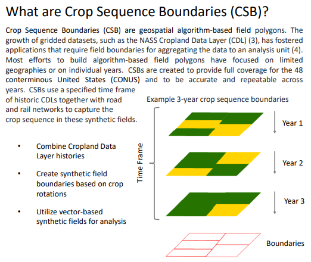

<<<<<<< Updated upstream
# usda-csb-data
 Crop Service Boundaries data from USDA
=======
# USDA Crop Sequence Boundaries Data



In July 2023, the USDA released a public data set of Crop Sequence Boundaries in the United States. This data was in a heavy file format (*.gsb*) that ate up over 25GB of memory when trying to read the entire *.gsb* file in either R or Python.

In order to work with this data in either of those two open source programming languages, it needed to be ported to a different file format. The [py](py/) directory in this repository contains an [example script](py/convert_to_parquet_example.py) for ingesting the *.gsb* file and writing it out to *.parquet* format every `n` number of rows (in our example, we used `n = 1,000,000`).

Next, the [R](R/) directory in this repository contains an [example script](R/repartition_example.R) for re-partitioning the Parquet data by the unique values in a column in the data (in our example, we re-partitioned the data by `STATEFIPS` code).

Lastly, the [data](data/) directory in this repository contains *.csv* files that can be used to convert integer codes in the CSB data to their plain-English equivalents.

## How to Access this Data Yourself

[Ketchbrook Analytics](https://www.ketchbrookanalytics.com) has hosted the 2022 CSB data in a public AWS S3 bucket (in .parquet format, partitioned by year and STATEFIPS code). [This blog post](https://blog.ketchbrookanalytics.com/posts/2023-08-09-geoparquet-for-usda-crop-maps/geoparquet-for-usda-crop-maps) can walk you through how to connect to this data yourself, using R. If you can't wait to read the blog post, this R code should help you get started:

```r
library(arrow)
library(dplyr)

# Confirm connecting to s3 buckets is enabled on your machine
arrow::arrow_with_s3()

# Specify the s3 bucket containing the CSB .parquet data
bucket <- arrow::s3_bucket("ketchbrook-public-usda-nass-csb")

# List the directories and files in the bucket
bucket$ls("year=2022", recursive = TRUE)

# Calculate the average number of crop sequence boundary acres in Fairfield County, Connecticut
arrow::open_dataset(bucket) |>
  dplyr::filter(
    STATEFIPS == 09,
    CNTY == "Fairfield"
  ) |>
  dplyr::summarise(
    mean_CSBACRES = mean(CSBACRES, na.rm = TRUE)
  ) |>
  dplyr::collect()
```
>>>>>>> Stashed changes

## Useful Links

* [USDA NASS CSB Data Home Page](https://www.nass.usda.gov/Research_and_Science/Crop-Sequence-Boundaries/)
* [CSB Metadata](https://www.nass.usda.gov/Research_and_Science/Crop-Sequence-Boundaries/metadata_Crop-Sequence-Boundaries-2022.htm)
* [USDA Whitepaper](https://www.nass.usda.gov/Education_and_Outreach/Reports,_Presentations_and_Conferences/reports/conferences/ICAS-2023/Crop%20Sequence%20Boundaries%20(CSB)%20Delineated%20Fields%20Using%20Remotely%20Sensed%20Crop%20Rotations.pdf)
* [USDA Slide Deck](https://www.nass.usda.gov/Education_and_Outreach/Reports,_Presentations_and_Conferences/reports/conferences/ESRI-2022/Esri_UC_TheCropSequenceBoundariesProject.pdf)

## What are Crop Sequence Boundaries (CSB)?

